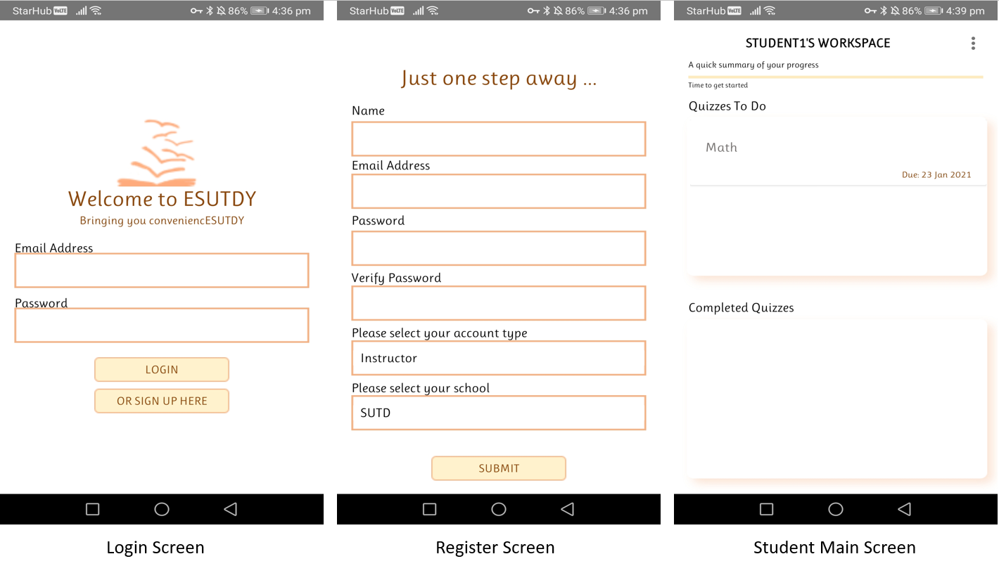
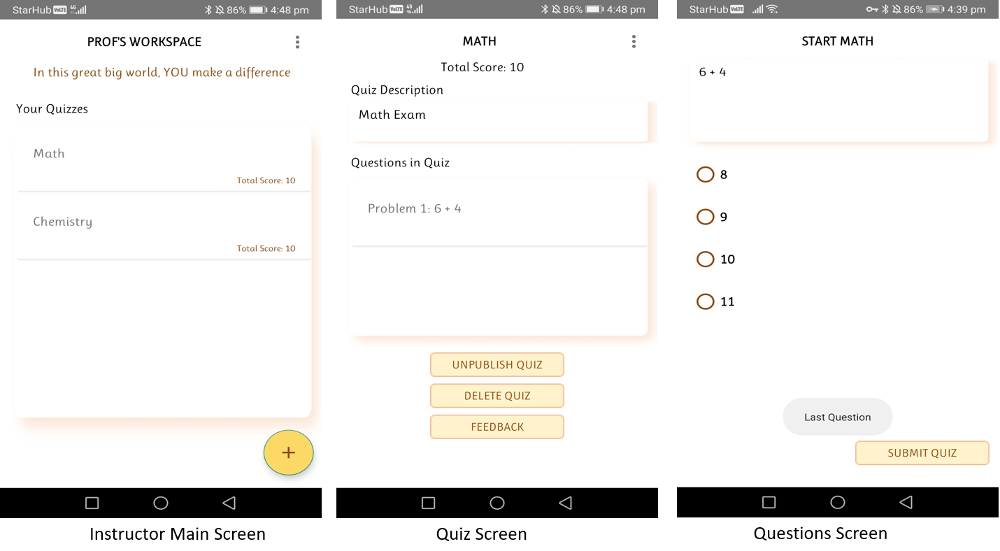
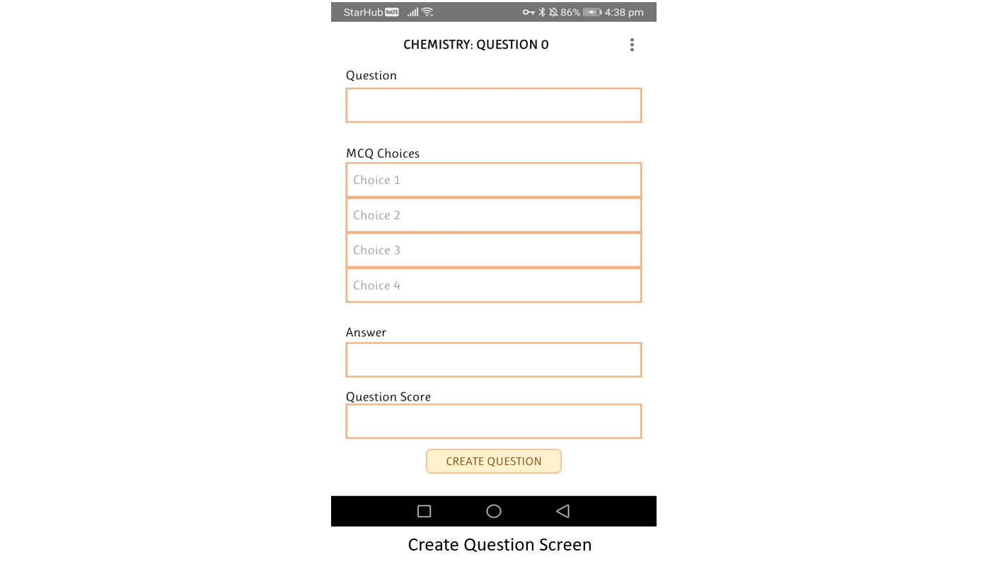
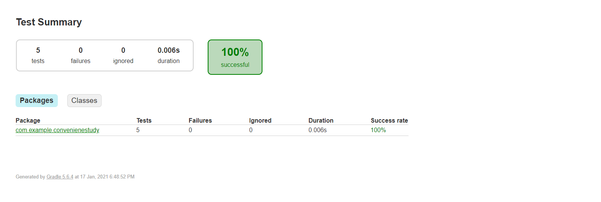

# Android App with Jenkins

Hello, this is an e-learning android app with CI/CD integration using Jenkins with Firebase as its database.


## Getting Started

Fork and clone from the development branch.

### App Features

- Easy Sign-up/Login 
- Instructors can create quizzes and publish them, while also tracking students' scores and giving feedback


### App Screenshots








## Workflow

Branch: Feature -> Development -> Main

The Main branch is the final build of the app where we would push to play store.

Development branch is where we will go through the unit tests and build the appDebug apk to test.

Feature branch is where each individual will work on their code in their local repository. Once they are done, they will commit and push to development branch.

## Jenkins Integration

Every time the remote development branch is pushed, Jenkins will automatically compile, build, test and archive the apk. 

Under Configure -> Build -> Gradle Wrapper -> Tasks:
```
clean
testDebugUnitTest
assembleDebug
```
### Build Triggers

Select 'GitHub hook trigger for GITScm polling'

### WebHooks

We use Ngrok to configure our localhost as a public url. 

Download Ngrok and go to its directory and run the following command:

```
./ngrok http 8080
```

Get the public url tagged to your localhost, such as 
"http://70ea1975d2d2.ngrok.io"

Go to your github repository -> settings -> Webhooks -> Payload URL and add:

```
"http://70ea1975d2d2.ngrok.io/github-webhook/"
```

Select push event as trigger.

From here onwards, everytime your development is updated, Jenkins will run the job.

## Post-build Actions

### Generating the APK 

The apk file is stored in the path "app/build/outputs/apk/debug/app-debug.apk"

To generate the apk, simply add the file path under the "Archive the artifacts" section.

### Publish Unit Test Report
A Unit Test report will also be generated.

Under "Publish HTML Reports", add the followng line to the html directory:
```
app\build\reports\tests\testDebugUnitTest
```




